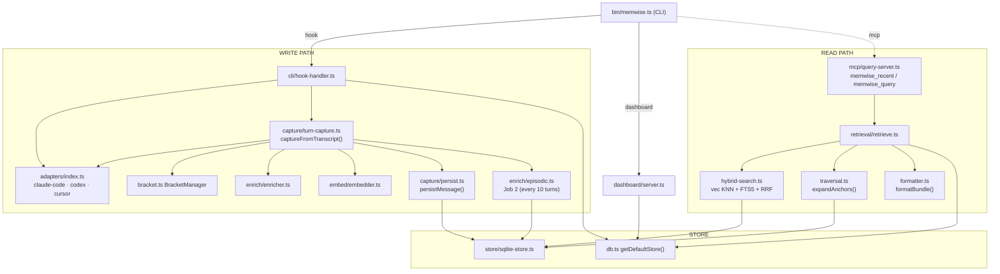

# MemWise

**Local-first memory for AI coding agents that survives compaction and follows you across agents and sessions.**

Your AI never loses the thread — not after `/compact`, not in a brand-new session, not when you switch between Claude Code, Codex, and Cursor. MemWise captures every coding turn the moment it happens, structures it like a git commit, and surfaces the right context when you need it.

> *git tracks what changed. MemWise tracks why.*

---

## The problem

Every coding agent has the same memory cliff: the context window fills up, compaction wipes it, and the next session starts from zero. The agent that helped you design the retry logic last Tuesday has no idea what you built. You re-explain. Again.

MemWise captures that context at the edges — the turn boundary, the compaction trigger — and stores it in a local SQLite database that never leaves your machine.

---

## How it works

At every turn end, MemWise reads the agent's transcript, reconstructs what happened (prompt → narration → code changes), and writes a single atomic record:

```
prompt: "add retry with exponential backoff to charge()"
  ├── sig: sha256(prompt + all edits)          ← deterministic, like a git hash
  ├── code changes: [charge.ts::retry (added), utils.ts::sleep (added)]
  ├── symbol deps: [processPayment → charge, checkout → processPayment]
  ├── context: enriched prose of what was done and why
  └── vector: embedded context for semantic search
```

That record is queryable instantly. No daemon, no hot window, no rebuild. The write and the read hit the same SQLite database.

---

## Architecture

```
┌─────────────────────────────────────────────────────────────────┐
│  CAPTURE  (write path, one atomic write per turn)               │
│                                                                 │
│  Agent hook (Stop / UserPromptSubmit / PreCompact)              │
│    → read transcript from disk                                  │
│    → replay through BracketManager → FinalizedMessage           │
│    → enrich contextText (local LLM, async, graceful)           │
│    → embed enriched text (Ollama)                               │
│    → ONE transaction: prompt_sig + changes + symbol_deps        │
│                      + context_chunk + vector                   │
│    → Job 2: every 10 turns, merge into a nightshift summary     │
└─────────────────────────────────────────────────────────────────┘

┌─────────────────────────────────────────────────────────────────┐
│  RETRIEVAL  (read path, two MCP tools)                          │
│                                                                 │
│  memwise_recent  →  last N turns + session summary              │
│                     (what happened recently)                    │
│                                                                 │
│  memwise_query   →  hybrid search (vec KNN + FTS5 BM25 + RRF)  │
│                     → expand anchors (parent chain + blast      │
│                       radius) → format context block            │
│                     (why did we change X, where is feature Y)   │
└─────────────────────────────────────────────────────────────────┘
```

### The spine model

The unit of memory is the **message** — one user prompt produces exactly one node. All edits made during that turn are children of that node. This is different from systems that fragment per-observation: you get a coherent "commit object" for every turn, with a reasoning chain that walks backward through parent signatures.

```
prompt_sig("add retry to charge")           ← the spine node
  ├── change: charge.ts::retry (added)
  ├── change: utils.ts::sleep (added)
  ├── context_chunk: "Added exponential backoff..."  + vector
  └── parent_sig → prompt_sig("refactor payment service")
                      └── parent_sig → prompt_sig("design payment flow")
```

"Why does retry exist?" walks: `change(retry) → prompt_sig → context + parent chain`.

### The signature

```
sig = sha256(promptText + "\x00" + sorted(file, symbol, changeType)[])
```

Same prompt + same edits = identical sig. Deterministic dedup, stable DAG, reproducible benchmarks. The LLM enriches the content — never the identity.

---

## Call graph



---

## MCP tools

Two tools, clean split. The agent picks based on the question.

**`memwise_recent`** — time-based. No search. Returns the last N turns + the latest session summary (nightshift recap). Use for: *"catch me up"*, *"where did we leave off"*, start of a new session.

**`memwise_query`** — content-based. Hybrid RAG search (semantic + symbol lookup + blast radius). Returns the most relevant past turns with code changes and decision chain. Use for: *"when did we change X and why"*, *"what is the role of service Y"*, *"why did we pick this approach"*.

The routing is gone — the agent reads the descriptions and picks. No internal regex matching the question text.

---

## Capture path — three agents, one pipeline

All three agents write transcripts to disk. MemWise reads the transcript at turn end, not the live event stream. The same pipeline handles all three.

```
Agent         Hook events used                    Transcript format
──────────────────────────────────────────────────────────────────
Claude Code   Stop · UserPromptSubmit · PreCompact  {type, message, uuid} JSONL
Codex         Stop · UserPromptSubmit · PreCompact  {timestamp, type, payload} rollup
Cursor        stop · beforeSubmitPrompt · preCompact {role, message:{content}} JSONL
```

Each agent has a concrete `AgentAdapter` — `parseHook()` + `readTranscript()`. The capture pipeline calls `getAdapter(source)` and doesn't know which agent it's talking to.

---

## Performance

Benchmarked at N=200, 300 seeded rows, mocked embed (~1ms):

| Path | p50 | p95 | p99 |
|---|---|---|---|
| `persistMessage` (capture) | 3.8ms | 4.1ms | 8.3ms |
| `retrieve: semantic` | 4.4ms | 6.8ms | 7.2ms |
| `retrieve: recency` | 2.2ms | 2.7ms | 3.0ms |
| `retrieve: session` | 2.4ms | 3.0ms | 3.3ms |

Capture is a single SQLite transaction. Write latency stays flat as the corpus grows — no index rebuild (agentmemory rebuilds its full in-memory index on every batch: 177ms at 240 rows, 1.7s at 10k rows).

Real retrieval adds Ollama embed RTT (~20-80ms). Benchmark with `BENCH_N=500 npx tsx bench/p99.ts`.

---

## Embedding models

The encoder is swappable — not hardcoded in the schema.

```
MEMWISE_EMBED_MODEL=snowflake-arctic-embed:33m   (default, 384-dim, ~8ms encode)
MEMWISE_EMBED_DIM=384
```

Candidates in the sweep:

| Model | Dim | Encode | Role |
|---|---|---|---|
| `all-minilm` | 384 | ~8ms | Fairness baseline (= agentmemory's encoder) |
| `snowflake-arctic-embed:33m` | 384 | ~8ms | **Provisional default** |
| `nomic-embed-text` | 768 | ~50ms | Long-context (8192 ctx) |
| `embeddinggemma` | 768 / 256 / 128 (MRL) | ~40ms | Quality ceiling, tunable dim |
| `qwen3-embedding:0.6b` | 1024 (MRL) | slowest | Highest quality |

The benchmark headline uses `all-minilm` — the same encoder as agentmemory — so any quality win is provably architectural, not a better embedder.

---

## Job 2 — episodic consolidation

Every 10 captured turns, MemWise merges recent postcompact summaries and enriched context chunks into one `nightshift` summary via a local LLM. This is what `memwise_recent` surfaces as "last work here." Configurable:

```
MEMWISE_EPISODIC_MIN_NEW_CHUNKS=10   (default)
```

Graceful: if no chat model is available, the raw postcompact summaries are used instead.

---

## Stack

```
TypeScript / Node 20+
SQLite + sqlite-vec (KNN) + FTS5 (BM25)
tree-sitter — incremental parsing, 8 grammars (TS, JS, Python, Go, Java, Rust, C, C++)
Ollama — embeddings + local LLM enrichment (qwen2.5:3b enrich, arctic-embed:33m embed)
@modelcontextprotocol/sdk — MCP server (stdio)
commander — CLI
```

No Redis. No daemon. No rebuild. One SQLite file at `~/.memwise/memwise.db`.

---

## Install

```bash
npm install -g memwise
memwise init          # writes hooks to ~/.claude/settings.json, ~/.cursor/hooks.json, ~/.codex/settings.json
                      # registers MCP server with Claude Code
                      # spins up the dashboard at localhost:4242
```

Override the DB path or model at any time:

```bash
MEMWISE_DB_PATH=~/projects/myproject/.memwise.db memwise init
MEMWISE_EMBED_MODEL=embeddinggemma MEMWISE_EMBED_DIM=768 memwise init
```

---

## CLI

```
memwise init              detect agents, write hooks, register MCP, launch dashboard
memwise dashboard         open the observability dashboard (localhost:4242)
memwise hook --source <agent>   hook handler (called by the agent)
memwise query "why did we add retry"   manual retrieval query
memwise replay <transcript>    replay a transcript into the store
memwise consolidate        run Job 2 manually
```

---

## Tests

```bash
npm test              # full suite (82 tests)
npm run test:readers  # Cursor + Codex transcript reader tests
npm run test:adapters # adapter strategy tests
npm run bench         # p99 benchmark
```

