# MemWise — call graph

```mermaid
flowchart TD
    %% ===== Entry points =====
    bin["bin/memwise.ts<br/>(commander CLI)"]
    mcp["mcp/query-server.ts<br/>memwise_session / memwise_query"]
    dash["dashboard/server.ts"]
    replay["replay/replay.ts<br/>(test harness)"]

    bin -->|hook| hook
    bin -->|dashboard| dash
    bin -.->|mcp| mcp
    bin -->|replay| replay

    %% ===== WRITE PATH =====
    subgraph WRITE["WRITE PATH — capture"]
        hook["cli/hook-handler.ts<br/>handleHook()"]
        adapters["adapters/index.ts parseHook()<br/>claude-code · codex · cursor · common"]
        tcap["capture/turn-capture.ts<br/>captureFromTranscript()"]
        treader["replay/transcript-reader.ts<br/>readTranscript()"]
        bracket["bracket.ts<br/>BracketManager.handle()"]
        applypatch["adapters/apply-patch.ts"]
        sig["signature.ts<br/>computeMessageSig()"]
        capone["captureOne()"]
        enricher["enrich/enricher.ts<br/>Enricher.enrich()"]
        embedder["embed/embedder.ts<br/>Embedder.embed()"]
        persist["capture/persist.ts<br/>persistMessage()"]
        episodic["enrich/episodic.ts<br/>maybeConsolidate() (Job 2)"]

        hook --> adapters
        hook --> tcap
        tcap --> treader
        tcap --> adapters
        tcap --> bracket
        bracket --> applypatch
        bracket --> sig
        bracket --> bridge
        tcap --> capone
        capone --> enricher
        capone --> embedder
        capone --> persist
        tcap --> episodic
    end

    %% ===== PARSER subsystem =====
    subgraph PARSER["parser/ (tree-sitter, behind one door)"]
        bridge["parser/bridge.ts<br/>changesFromToolInput()"]
        pclient["parser/parser-client.ts<br/>parseInWorker()"]
        worker["parser/worker-ipc.ts"]
        incr["parser/incremental.ts"]
        treecache["parser/tree-cache.ts"]
        editutils["parser/edit-utils.ts"]
        symmap["parser/symbol-mapper.ts"]
        depmap["parser/dependency-mapper.ts"]
        langs["parser/languages.ts"]

        bridge --> pclient
        bridge --> incr
        bridge --> langs
        pclient --> worker
        worker --> incr
        incr --> treecache
        incr --> editutils
        incr --> symmap
        incr --> depmap
        incr --> langs
        depmap --> symmap
    end

    %% ===== EMBED / ENRICH backends =====
    subgraph BACKEND["embed/ + enrich/ backends (Ollama)"]
        chunker["pipeline/chunker.ts chunkText()"]
        ollama["embed/ollama-client.ts<br/>defaultOllamaEmbed()"]
        vector["embed/vector.ts meanPool()"]
        genclient["embed/generate-client.ts<br/>(LLM rewrite)"]

        embedder --> chunker
        embedder --> ollama
        embedder --> vector
        enricher --> genclient
        episodic --> enricher
        episodic --> genclient
    end

    %% ===== READ PATH =====
    subgraph READ["READ PATH — retrieve"]
        inject["cli/inject.ts<br/>injectContext()"]
        retrieve["retrieval/retrieve.ts<br/>retrieve()"]
        router["retrieval/router.ts route()"]
        hybrid["retrieval/hybrid-search.ts<br/>searchAnchors() / searchRecentAnchors()"]
        traversal["retrieval/traversal.ts<br/>expandAnchors()"]
        formatter["retrieval/formatter.ts<br/>formatBundle() / countTokens()"]
        rrf["rrf.ts (RRF fusion)"]
        tokens["tokens.ts"]

        mcp --> retrieve
        inject --> retrieve
        inject --> formatter
        retrieve --> router
        retrieve --> hybrid
        retrieve --> traversal
        retrieve --> formatter
        retrieve --> ollama
        hybrid --> rrf
        formatter --> tokens
    end

    %% bridge between paths: SESSION_START hook runs the read path
    hook -.->|SESSION_START| inject

    %% ===== SHARED CORE / STORE =====
    subgraph CORE["shared core + store"]
        db["db.ts getDefaultStore()"]
        config["config.ts"]
        schema["store/schema.ts (DDL)"]
        sqlite["store/sqlite-store.ts"]
        mstore["store/memory-store.ts<br/>(MemoryStore interface + row types)"]
        types["types.ts (data contract)"]
        project["project.ts projectIdFromPath()"]

        db --> config
        db --> schema
        db --> sqlite
        sqlite -. implements .-> mstore
        types --> mstore
    end

    %% store handle: everyone grabs it through db
    hook --> db
    retrieve --> db
    dash --> db
    replay --> db

    %% persistence sinks
    persist --> sqlite
    episodic --> sqlite
    dash --> sqlite

    %% store reads
    router --> mstore
    traversal --> mstore
    hybrid --> mstore
    formatter --> mstore

    %% replay re-enters both pipelines
    replay --> tcap
    replay --> retrieve

    classDef entry fill:#1f2937,stroke:#60a5fa,color:#fff;
    classDef store fill:#0f3d2e,stroke:#34d399,color:#fff;
    class bin,mcp,dash,replay entry;
    class db,sqlite,mstore,schema,config,types,project store;
```

## Legend / key facts

- **Two pipelines, one store.** Write path ends at `store/sqlite-store` via `persist`; read path starts from the same store via `retrieval/*`.
- **Single bridge between them:** the SESSION_START hook (`cli/hook-handler` → `cli/inject`) runs the read path inside a write-path hook.
- **`bracket.ts` is the only consumer of `parser/`**, which is a self-contained subgraph entered through `bridge.ts`.
- **`db.ts getDefaultStore()` is the universal store handle** — `hook-handler`, `retrieve`, `dashboard`, `replay` all acquire the store through it.
- **`embed/ollama-client`** is shared by both capture and retrieve (encode endpoint).
- Dotted edges = conditional/contract (`bin -.-> mcp` wired manually; `sqlite -. implements .-> memory-store`).
- `pipeline/classify.ts` and `pipeline/filter.ts` are standalone helpers (types-only deps), not on the live capture path — omitted from the graph.
