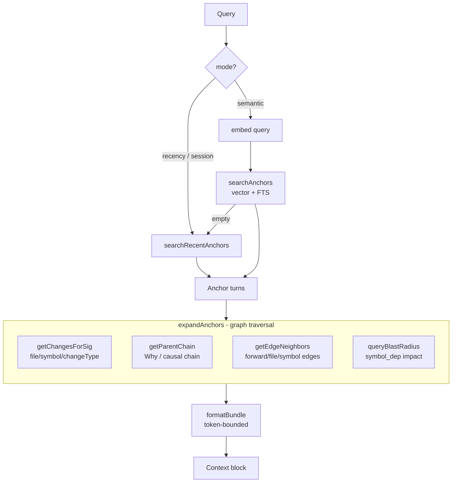
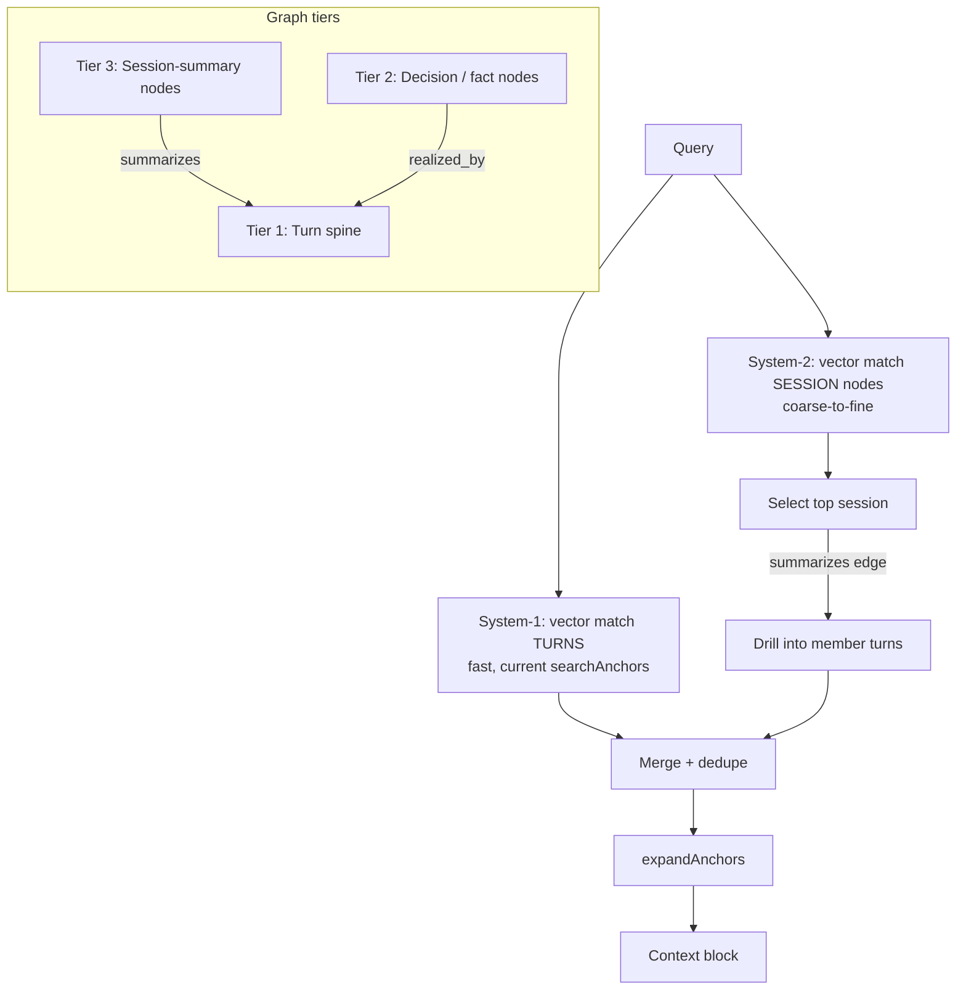
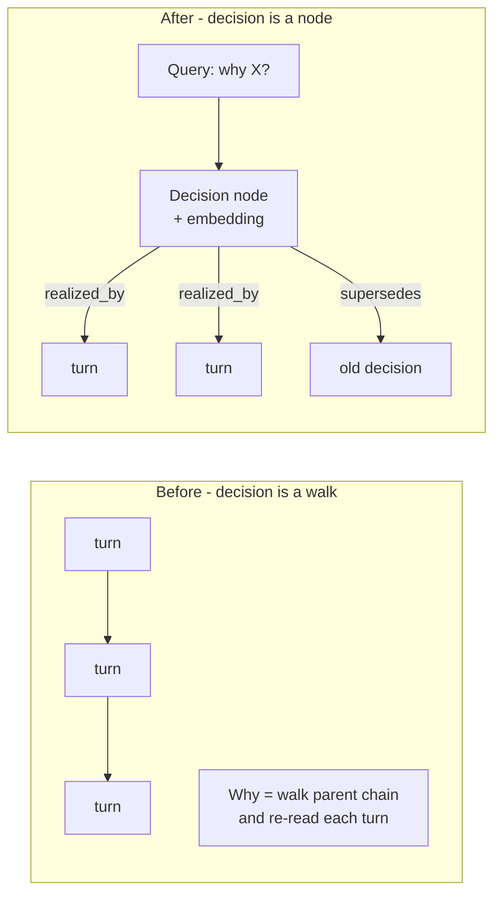
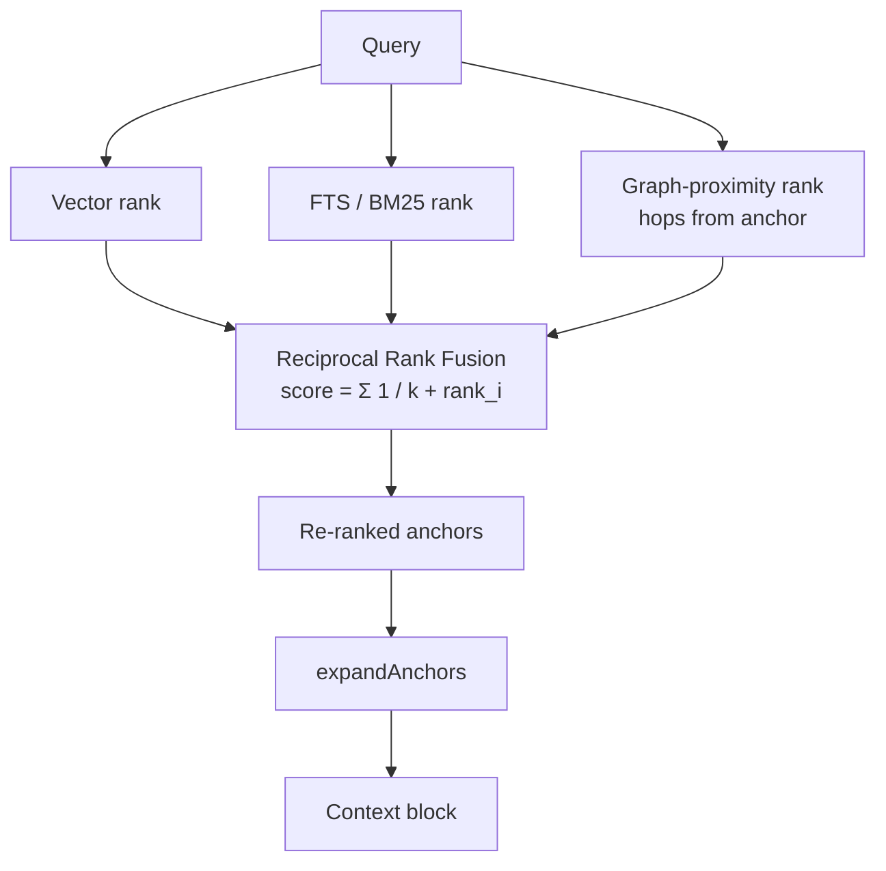
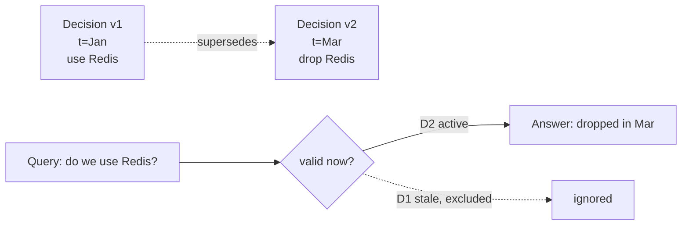
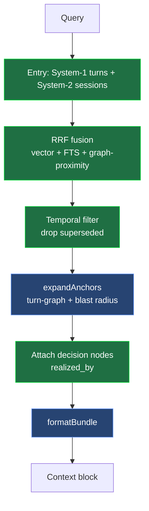

# MemWise Retrieval Strategies

Visual map of the current retrieval pipeline and the four GraphRAG strategies layered on top.

---

## 0. Current pipeline (what exists today)

`retrieve()` → `searchAnchors` (vector + FTS) → `expandAnchors` (graph traversal). This is already
hybrid graph-RAG: vector finds entry points, the turn-graph expands context.

---

## 1. Coarse-to-fine (session-summary nodes) — the dual-route win

Add **Tier-3 session nodes** with their own embedding, edged to member turns. Retrieval matches a
session first (coarse), then drills into only that session's turns (fine). Lets the agent walk a
*whole session / key decisions* without scanning every turn.

---

## 2. Decision nodes — promote the "Why" chain to first-class nodes

Today decisions live transiently inside `getParentChain`. Extract them (async / night-shift) into
`decision` nodes so "why did we pick X" is one hop, not a chain walk.

---

## 3. RRF fusion — make graph distance a ranking signal

Currently graph proximity only *filters* expansion (capped at 6). Promote it to a ranking signal and
fuse three ranked lists with Reciprocal Rank Fusion.

---

## 4. Temporal / supersedes edges — current vs stale facts

When a later decision contradicts an earlier one, add a `supersedes` edge instead of overwriting.
Retrieval filters by validity window so the agent gets the *current* answer.

---

## All strategies together

How the four layers compose into one retrieval call.

> Green = new strategies to add · Blue = already built.
